# Trabajo final - Control de Gastos Personales 💰

Aplicación web full-stack (por ahora solo backend) para registrar y gestionar gastos e ingresos personales. Permite categorizar transacciones, consultar el balance actual, ver el historial y filtrar por fecha o categoría.

Desarrollado como trabajo final de la materia Programación III — UTN.

---

## Integrantes

- Bautista Cutini
- Lautaro Capdeville
- Francesco DiCarli
- Santino Crivera
- Bautista Bartolini

---

# Levantar el Proyecto

## Requisitos Previos

- Docker instalado
- Docker Compose instalado

## Pasos

### 1. Construir las imágenes

Este paso solo es necesario la primera vez o cuando cambien las dependencias del proyecto.

```bash
docker-compose build
```

### 2. Iniciar todos los servicios

Levanta los contenedores definidos en el archivo `docker-compose.yml`.

```bash
docker-compose up -d
```

### 3. Ejecutar las migraciones

Crea las tablas necesarias en la base de datos.

```bash
docker-compose exec backend npx sequelize-cli db:migrate
```

### 4. Cargar datos de prueba

Inserta los datos iniciales para poder probar la aplicación.

```bash
docker-compose exec backend npx sequelize-cli db:seed:all
```

## Verificar que los contenedores estén funcionando

```bash
docker ps
```

## Detener los servicios

```bash
docker-compose down
```

## Documentacion Endpoints de la API

Base URL: `http://localhost:3001/api`

---

### Categorías

#### GET /categorias
Lista todas las categorías registradas.

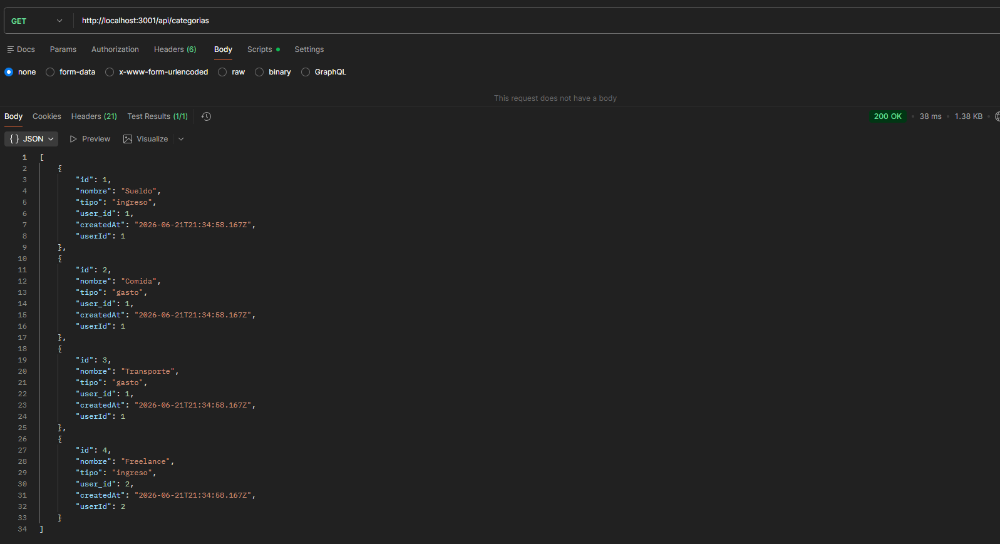

---

#### POST /categorias
Crea una nueva categoría.

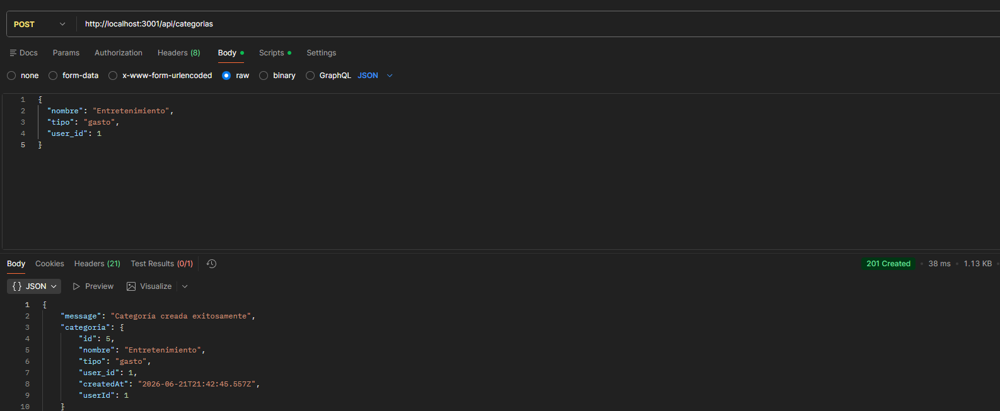

---

#### PUT /categorias/:id
Edita una categoría existente.

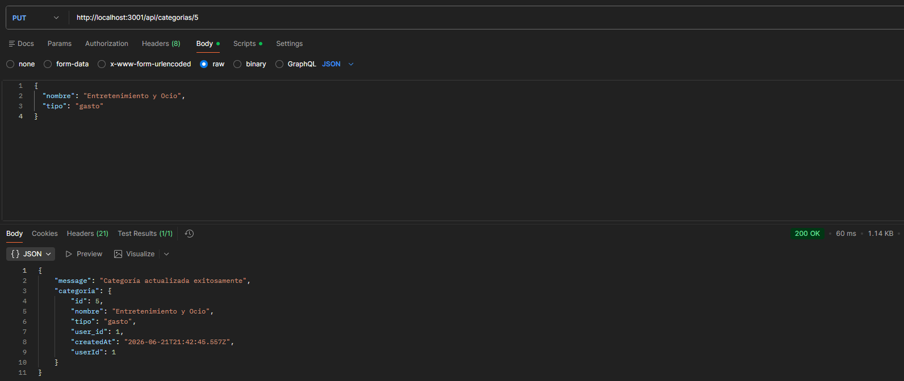

---

#### DELETE /categorias/:id
Elimina una categoría por su id.

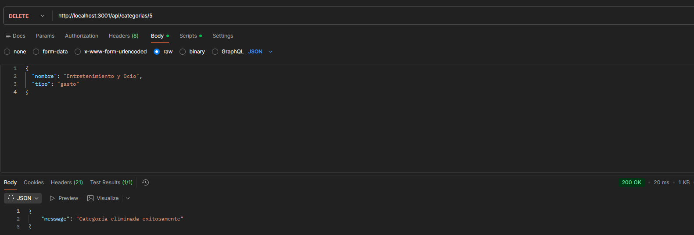

---

### Transacciones

#### GET /transacciones
Lista todas las transacciones.

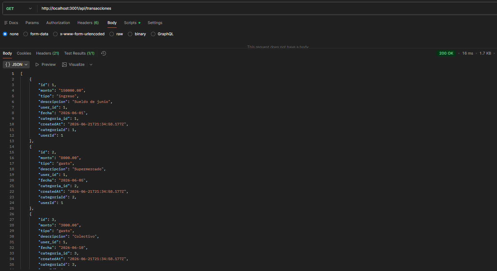

---

#### POST /transacciones
Crea una nueva transacción.

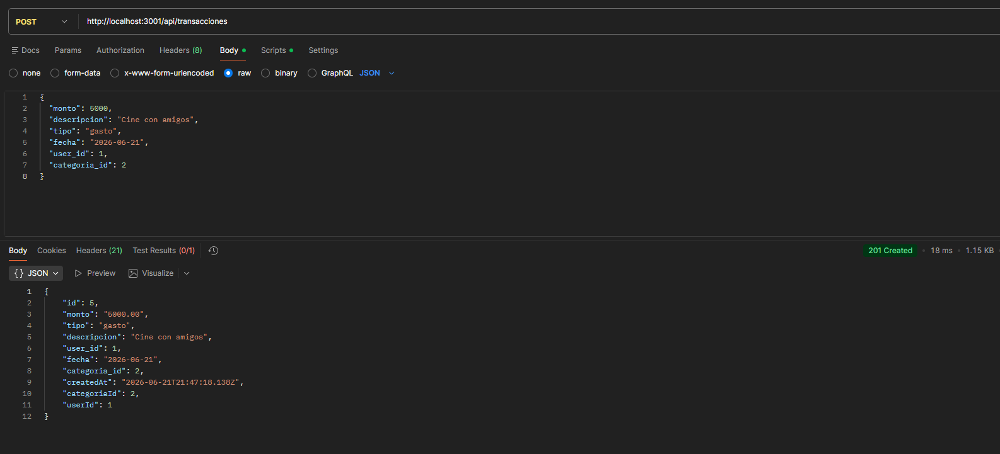

---

#### PUT /transacciones/:id
Actualiza una transacción existente.

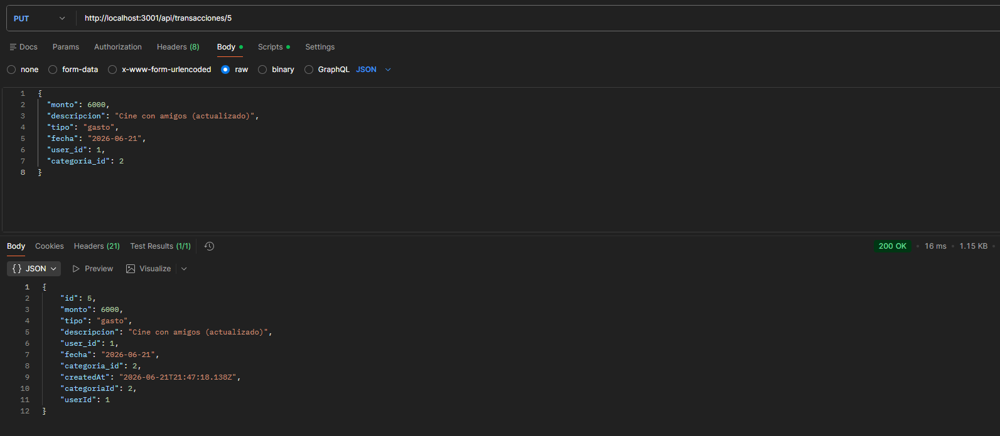

---

#### DELETE /transacciones/:id
Elimina una transacción por su id.

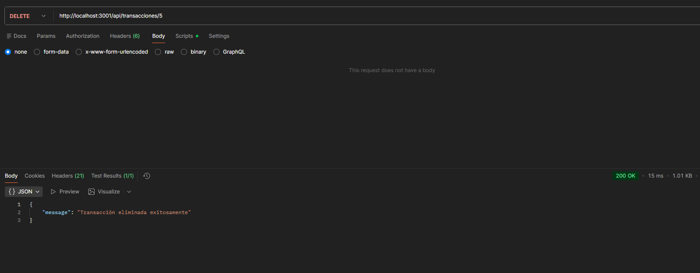

---

#### GET /transacciones/balance
Devuelve el balance actual (ingresos, gastos y diferencia).

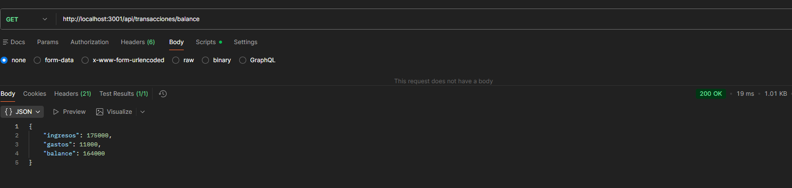

---

#### GET /transacciones/filtro
Filtra transacciones por fecha o categoría.

**Por categoría:** `/filtrar?categoria_id=1`

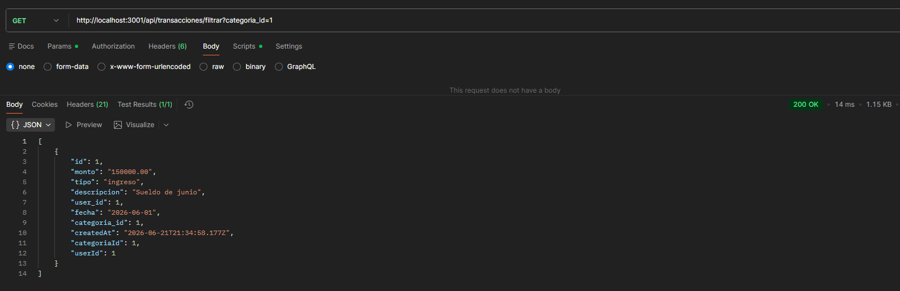

**Por fecha:** `/filtrar?fecha=2026-06-01`

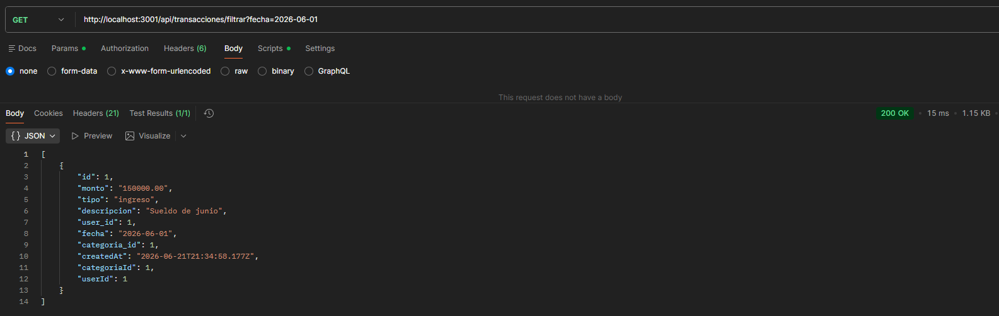

---


